

# Reinforcement Learning

Reinforcement learning is one of machine learning methods. As opposed to many forms of machine learning methods, the learner is not told which actions to take but instead it must take actions that yield most reward. The learner which we call the agent, is present in a state and according the state it is in, it has a set of actions that it can take. After taking an action, the environment yields a reward to the agent based on how good or bad the taken action is.

## The Elements of Reinforcement Learning

The typical reinforcement learning system has four main subelements: policy, reward, value function, model

### Policy

A policy defines the learning agent’s way of behaving at a given time. Roughly speaking, a policy is a mapping from perceived states of the environment to actions to be taken when in those states. In some cases the policy may be a simple function or lookup table, whereas in others it may involve extensive computation such as a search process. The policy is the core of a reinforcement learning agent in the sense that it alone is sufficient to determine behavior. In general, policies may be stochastic.

### Reward

A reward signal defines the goal in a reinforcement learning problem. On each time step, the environment sends to the reinforcement learning agent a single number, a reward. The agent’s sole objective is to maximize the total reward it receives over the long run. The reward signal thus defines what are the good and bad events for the agent.

When we talk about rewards, one may think that when solving a reinforcement problem the rewards have to be one positive and one negative. Although this might be true for some problems, it does not have to be like that. For some problems, rewards can only be negative or positive numbers. For instance, if the goal of an agent is to find the exiting cell in a maze as fast as possible, the reward can be -1 for each action the agent takes and 0 for reaching the exiting cell. In that scenario, we penalize the agent by each action that it takes so that it does not waste time to visit unnecessary cells.

### Value Function

Whereas the reward signal indicates what is good in an immediate sense, a value function specifies what is good in the long run. Roughly speaking, the value of a state is the total amount of reward an agent can expect to accumulate over the future, starting from that state. Whereas rewards determine the immediate, intrinsic desirability of environmental states, values indicate the long-term desirability of states after taking into account the states that are likely to follow, and the rewards available in those states.

If we were to give an example from real-world, one might think that going after short-term pleasures is giving them the most reward such as eating fast food or not exercising, but in the long-run doing so actually hurts them. So, the similiar situation happens for an agent as well. In chess for instance, taking the opponent's pawn might give a reward but when it is time to make a move for an opponent, the agent might lose its queen or lose the game. Therefore, value function tells us how good it is if we take an action and be in the next state.

### Model

A model of the environment mimics the behavior of the environment, or more generally, that allows inferences to be made about how the environment will behave. For example, given a state and action, the model might predict the resultant next state and next reward. Models are used for planning, by which we mean any way of deciding on a course of action by considering possible future situations before they are actually experienced. Methods for solving reinforcement learning problems that use models and planning are called **model-based** methods, as opposed to simpler **model-free** methods that are explicitly trial-and-error learners—viewed as almost the opposite of planning.

To summarize above until now:

**Agent:** An entity that takes actions and hopefully finds the optimal action.

**Environment:** The surrounding that the agent interacts with

**State:** Defines the current situation of the agent

**Action:** The choice that the agent makes at the current timestep

**Policy:** A probability distribution assigned to the set of actions. High rewarding actions will have high probability and vice versa.

## Agent-Environment Interface

The agent and environment interact at each of a sequence of discrete time steps, $t = 0, 1, 2, 3,...$ At each time step $t$, the agent receives some representation of the environment’s state, $S_t \in S$, where $S$ is the set of possible states, and on that basis selects an action, $A_t \in A(S_t)$, where $A(S_t)$ is the set of actions available in state $S_t$. One time step later, in part as a consequence of its action, the agent receives a numerical reward , $R_{t+1} \in \mathbf{R} \subset \mathbb{R}$, and finds itself in a new state, $S_{t+1}$. Note that the vertical dashed line indicates the next timestep.

At each time step, the agent implements a mapping from states to probabilities of selecting each possible action. This mapping is called the agent’s policy and is denoted $\pi_t$, where $\pi_t(a|s)$ is the probability that $A_t = a$ if $S_t = s$. Reinforcement learning methods specify how the agent changes its policy as a result of its experience. The agent’s goal, roughly speaking, is to maximize the total amount of reward it receives over the long run.

## Returns

We have said that the agent’s goal is to maximize the cumulative reward it receives in the long run. If the sequence of rewards received after time step $t$ is denoted $R_{t+1}, R_{t+2}, R_{t+3},...,$ then we seek to maximize the expected return, where the return $G_t$ is defined as some specific function of the reward sequence. In the simplest case the return is the sum of the rewards:

$G_t = R_{t+1} + R_{t+2} + R_{t+3} + ··· + R_T,$

where $T$ is a final time step. This approach makes sense in applications in which there is a natural notion of final time step, that is, when the agent-environment interaction breaks naturally into subsequences, which we call **episodes**, such as plays of a game, trips through a maze, or any sort of repeated interactions. Each episode ends in a special state called the terminal state, followed by a reset to a standard starting state or to a sample from a standard distribution of starting states. Tasks with episodes of this kind are called episodic tasks. In episodic tasks we sometimes need to distinguish the set of all nonterminal states, denoted $S$, from the set of all states plus the terminal state, denoted $S^+$.

On the other hand, in many cases the agent–environment interaction does not break naturally into identifiable episodes, but goes on continually without limit. For instance, the pole-balancing task. The return formulation is problematic for continuing tasks because the final time step would be $T = \infty$, and the return, which is what we are trying to maximize, could itself easily be infinite.

The additional concept that we need is that of discounting. According to this approach, the agent tries to select actions so that the sum of the discounted rewards it receives over the future is maximized. In particular, it chooses $A_t$ to maximize the expected discounted return:

$G_t = R_{t+1} + \gamma R_{t+2} + \gamma^2 R_{t+3} + ··· = \sum_{k=0}^{\infty} \gamma^k R_{t+k+1},$

where $\gamma$ is a parameter, $0 ≤ \gamma ≤ 1$, called the discount rate.

The discount rate determines the present value of future rewards: a reward received $k$ time steps in the future is worth only $\gamma^{k−1}$ times what it would be worth if it were received immediately. If $\gamma = 0$, the agent is *myopic* in being concerned only with maximizing immediate rewards: its objective in this case is to learn how to choose $A_t$ so as to maximize only $R_{t+1}$. As the $\gamma$ approaches $1$, the objective takes future rewards into account more strongly: the agent becomes more *farsighted*.

## The Markov Property

In the reinforcement learning framework, the agent makes its decisions as a function of a signal from the environment called the environment’s *state*. A state signal that succeeds in retaining all relevant information is said to be **Markov**, or to have **the Markov property**. For example, a checkers position—the current configuration of all the pieces on the board—would serve as a Markov state because it summarizes everything important about the complete sequence of positions that led to it. Much of the information about the sequence is lost, but all that really matters for the future of the game is retained.

Consider how a general environment might respond at time $t + 1$ to the action taken at time $t$. In the most general, causal case this response may depend on everything that has happened earlier. In this case the dynamics can be defined only by specifying the complete probability distribution:

$Pr\{R_{t+1} = r, S_{t+1} = s^\prime | S_0, A_0, R_1, ..., S_{t−1}, A_{t−1}, R_t, S_t, A_t\},$

for all $r, s^\prime$, and all possible values of the past events: $S_0, A_0, R_1, ..., S_{t−1}, A_{t−1}, R_t, S_t, A_t$. If the state signal has the Markov property, on the other hand, then the environment’s response at $t + 1$ depends only on the state and action representations at $t$, in which case the environment’s dynamics can be defined by specifying only
$$
\begin{equation} \tag{3.5}
    p(s^\prime, r|s, a) = Pr\{R_{t+1} = r, S_{t+1} = s^\prime | S_t, A_t\},
\end{equation}
$$

for all $r, s^\prime, S_t,$ and $A_t$.

If an environment has the Markov property, then its one-step dynamics $(3.5)$ enable us to predict the next state and expected next reward given the current state and action. One can show that, by iterating this equation, one can predict all future states and expected rewards from knowledge only of the current state as well as would be possible given the complete history up to the current time. It also follows that Markov states provide the best possible basis for choosing actions. That is, the best policy for choosing actions as a function of a Markov state is just as good as the best policy for choosing actions as a function of complete histories.

The Markov property is important in reinforcement learning because decisions and values are assumed to be a function only of the current state. In order for these to be effective and informative, the state representation must be informative.

## Markov Decision Processes (MDPs)

A reinforcement learning task that satisfies the Markov property is called a Markov decision process, or MDP. If the state and action spaces are finite, then it is called a finite Markov decision process (finite MDP).

A particular finite MDP is defined by its state and action sets and by the one-step dynamics of the environment. Given any state and action $s$ and $a$, the probability of each possible pair of next state and reward, $s^\prime, r$, is denoted
$$
\begin{equation} \tag{3.6}
    p(s^\prime, r|s, a) = Pr\{S_{t+1} = s^\prime, R_{t+1} = r | S_t = s, A_t = a\}.
\end{equation}
$$

**Write a program that simulates Recycling Robot MDP (page 81)**

## Value Functions

Almost all reinforcement learning algorithms involve estimating value functions—functions of states (or of state–action pairs) that estimate how good it is for the agent to be in a given state (or how good it is to perform a given action in a given state). The notion of “how good” here is defined in terms of future rewards that can be expected, or, to be precise, in terms of expected return. Of course the rewards the agent can expect to receive in the future depend on what actions it will take. **Accordingly, value functions are defined with respect to particular policies.**

### State-Value Function for a Policy

Recall that a policy, $\pi$, is a mapping from each state, $s \in S$, and action, $a \in A$(s), to the probability $\pi(a|s)$ of taking action a when in state $s$. Informally, the value of a state s under a policy $\pi$, denoted $v_\pi(s)$, is the expected return when starting in $s$ and following $\pi$ thereafter. For MDPs, we can define $v_\pi(s)$ formally as

$$
v_\pi(s) = E_π[G_t | S_t = s] = E_π [\sum_{k=0}^\infty \gamma^k R_{t+k+1} ∣ S_t = s],
$$

where $E_\pi[·]$ denotes the expected value of a random variable given that the agent follows policy $\pi$, and $t$ is any time step. Note that the value of the terminal state, if any, is always zero. We call the function $v_\pi$ the *state-value function for policy $\pi$*.

### Action-Value Function for a Policy

Similarly, we define the value of taking action $a$ in state $s$ under a policy $\pi$, denoted $q_\pi(s, a)$, as the expected return starting from $s$, taking the action $a$, and thereafter following policy $\pi$:

$$
q_\pi(s, a) = E_\pi[G_t | S_t = s, A_t = a] = E_\pi [\sum_{k=0}^\infty \gamma^k R_{t+k+1} ∣ S_t = s, A_t = a ] .
$$

We call $q_\pi$ the *action-value function for policy $\pi$*.

The value functions $v_\pi$ and $q_\pi$ can be estimated from experience. For example, if an agent follows policy $\pi$ and maintains an average, for each state encountered, of the actual returns that have followed that state, then the average will converge to the state’s value, $v_\pi(s)$, as the number of times that state is encountered approaches infinity. If separate averages are kept for each action taken in a state, then these averages will similarly converge to the action values, $q_\pi(s, a)$. We call estimation methods of this kind Monte Carlo methods because they involve averaging over many random samples of actual returns.

Of course, if there are very many states, then it may not be practical to keep separate averages for each state individually. Instead, the agent would have to maintain $v_\pi$ and $q_\pi$ as parameterized functions and adjust the parameters to better match the observed returns. This can also produce accurate estimates, although much depends on the nature of the parameterized function approximator (Chapter 9).

### Backup Diagrams for $v_\pi$ and $q_\pi$

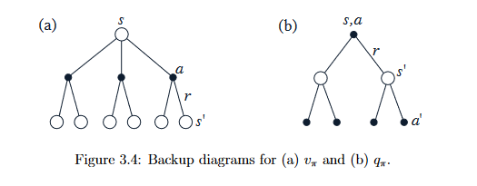

### Bellman Equation for $v_\pi$

$$
v_\pi(s) = \sum_a \pi(a|s) \sum_{s^\prime, r} p(s^\prime, r|s, a) [ r + \gamma v_\pi(s^\prime) ] ,
$$

**Write q_pi function as well**

It is really a sum over all values of the three variables, $a, s\prime,$ and $r$. For each triple, we compute its probability, $\pi(a|s)p(s\prime, r|s, a)$, weight the quantity in brackets by that probability, then sum over all possibilities to get an expected value.

Above equation is the Bellman equation for $v_\pi$. It expresses a relationship between the value of a state and the values of its successor states. Think of looking ahead from one state to its possible successor states, as suggested by above Figure 3.4a. Each open circle represents a state and each solid circle represents a state–action pair. Starting from state $s$, the root node at the top, the agent could take any of some set of actions—three are shown in Figure 3.4a. From each of these, the environment could respond with one of several next states, $s\prime$, along with a reward, $r$. The Bellman equation for $v_\pi$ averages over all the possibilities, weighting each by its probability of occurring. It states that the value of the start state must equal the (discounted) value of the expected next state, plus the reward expected along the way.

**Implement GridWorld from Example 3.8 (page  86)**

## Optimal Value Functions

Solving a reinforcement learning task means, roughly, finding a policy that achieves a lot of reward over the long run. For finite MDPs, we can precisely define an optimal policy in the following way. A policy $\pi$ is defined to be better than or equal to a policy $\pi^\prime$ if its expected return is greater than or equal to that of $\pi^\prime$ for all states. In other words, $\pi \geq \pi^\prime$ if and only if $v_\pi(s) \geq v_{\pi^\prime}(s)$ for all $s \in S$. There is always at least one policy that is better than or equal to all other policies. This is an optimal policy. Although there may be more than one, we denote all the optimal policies by $\pi_*$. They share the same state-value function, called the optimal state-value function, denoted $v_*$, and defined as

$v_∗(s) = \max_{\pi}v_\pi(s),$

for all $s \in S$.

Optimal policies also share the same optimal action-value function, denoted $q_∗$, and defined as

$q_∗(s, a) = \max_{\pi}q_\pi(s, a),$

for all $s \in S$ and $a \in A(s)$.

For the state–action pair $(s, a)$, this function gives the expected return for taking action $a$ in state $s$ and thereafter following an optimal policy. Thus, we can write $q_*$ in terms of $v_*$ as follows:

$q_∗(s, a) = E[R_{t+1} + \gamma v_∗(S_{t+1}) | S_t = s, A_t = a].$

### Backup Diagrams for $v_*$ and $q_*$

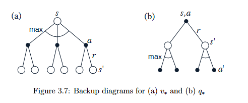

### Bellman Optimality Equation for $v_*$

Intuitively, the Bellman optimality equation expresses the fact that the value of a state under an optimal policy must equal the expected return for the best action from that state.

$$
v_* = \max_a E[R_{t+1} + \gamma v_*(S_{t+1}) | S_t = s, A_t = a]
$$

$$
\begin{equation} \tag{3.17}
  = \max_a \sum_{s^\prime, r} p(s^\prime, r | s, a) [ r + \gamma v_*(s^\prime) ]
\end{equation}
$$

The last two equations are two forms of the Bellman optimality equation for $v_*$.

### Bellman Optimality Equation for $q_*$
$$
q_*(s, a) = E[R_{t+1} + \gamma \max_{a^\prime}q_*(S_{t+1}, a^\prime) | S_t = s, A_t = a]
$$

$$
= \sum_{s^\prime, r} p(s^\prime, r | s, a) [r + \gamma \max_{a^\prime} q_*(s^\prime, a^\prime)]
$$

The Bellman optimality equation (3.17) is actually a system of equations, one for each state, so if there are N states, then there are N equations in N unknowns. If the dynamics of the environment are known $p(s^\prime, r|s, a)$, then in principle one can solve this system of equations for ($v_*$) using any one of a variety of methods for solving systems of nonlinear equations. One can solve a related set of equations for ($q_*$).

Once one has $v_∗$, it is relatively easy to determine an optimal policy. For each state $s$, there will be one or more actions at which the maximum is obtained in the Bellman optimality equation. Any policy that assigns nonzero probability only to these actions is an optimal policy. You can think of this as a one-step search. If you have the optimal value function, $v_∗$, then the actions that appear best after a one-step search will be optimal actions. Another way of saying this is that any policy that is greedy with respect to the optimal evaluation function $v_∗$ is an optimal policy.

The beauty of $v_∗$ is that if one uses it to evaluate the short-term consequences of actions—specifically, the one-step consequences—then a greedy policy is actually optimal in the longterm sense in which we are interested because $v_∗$ already takes into account the reward consequences of all possible future behavior. By means of $v_∗$, the optimal expected long-term return is turned into a quantity that is locally and immediately available for each state. Hence, a one-step-ahead search yields the long-term optimal actions.

Having $q_∗$ makes choosing optimal actions still easier. With $q_*$, the agent does not even have to do a one-step-ahead search: for any state s, it can simply find any action that maximizes $q_∗(s, a)$. The action-value function effectively caches the results of all one-step-ahead searches. It provides the optimal expected long-term return as a value that is locally and immediately available for each state–action pair. Hence, at the cost of representing a function of state–action pairs, instead of just of states, the optimal action-value function allows optimal actions to be selected without having to know anything about possible successor states and their values, that is, *without having to know anything about the environment’s dynamics*.

The on-line nature of reinforcement learning makes it possible to approximate optimal policies in ways that put more effort into learning to make good decisions for frequently encountered states, at the expense of less effort for infrequently encountered states. This is one key property that distinguishes reinforcement learning from other approaches to approximately solving MDPs.

## Dynamic Programming

The term dynamic programming (DP) refers to a collection of algorithms that can be used to compute optimal policies given a perfect model of the environment as a Markov decision process (MDP).

The key idea of DP, and of reinforcement learning generally, is the use of value functions to organize and structure the search for good policies. We can easily obtain optimal policies once we have found the optimal value functions, $v_*$ or $q_*$, which satisfy the Bellman optimality equations:

$$
v_* = \max_a E[R_{t+1} + \gamma v_*(S_{t+1}) | S_t = s, A_t = a]
$$

$$
\begin{equation} \tag{3.17}
  = \max_a \sum_{s^\prime, r} p(s^\prime, r | s, a) [ r + \gamma v_*(s^\prime) ]
\end{equation}
$$

or

$$
q_*(s, a) = E[R_{t+1} + \gamma \max_{a^\prime}q_*(S_{t+1}, a^\prime) | S_t = s, A_t = a]
$$

$$
= \sum_{s^\prime, r} p(s^\prime, r | s, a) [r + \gamma \max_{a^\prime} q_*(s^\prime, a^\prime)]
$$

Starting from now, unless the otherwise is specified, we assume that the environment dynamics are given by a set of probabilities $p(s^\prime, r| s,a).$

DP algorithms are obtained by turning Bellman equations such as these into assignments, that is, into update rules for improving approximations of the desired value functions.

### Policy Evaluation

First we consider how to compute the state-value function $v_\pi$ for an arbitrary policy $\pi$. This is called policy evaluation in the DP literature. We also refer to it as the *prediction problem*.

Recall that:

$$
v_\pi(s) = \sum_a \pi(a|s) \sum_{s^\prime, r} p(s^\prime, r|s, a) [ r + \gamma v_\pi(s^\prime) ] ,
$$

The initial approximation, $v_0$, is chosen arbitrarily (except that the terminal state, if any, must be given value 0), and each successive approximation is obtained by using the Bellman equation for $v_\pi$ as an update rule:

$$
v_{k+1}(s) = E_\pi[R_{t+1} + \gamma v_k(S_{t+1}) | S_t = s]
$$

$$
= \sum_a \pi(a | s) \sum_{s^\prime, r} p(s^\prime, r | s, a) [r + v_k(s^\prime)],
$$

for all $s \in S$. Clearly, $v_k = v_\pi$ is a fixed point for this update rule because the Bellman equation for $v_\pi$ assures us of equality in this case. Indeed, the sequence $\{v_k\}$ can be shown in general to converge to $v_\pi$ as $k -> \infty$ under the same conditions that guarantee the existence of $v_\pi$. This algorithm is called *iterative policy evaluation*.

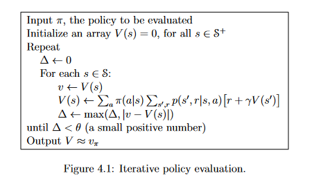

Note: You have two arrays: one for keeping the old values of the states and the other one for keeping the newly calculated values of the states. After each iteration you update the old array.

### Policy Improvement

Our reason for computing the value function for a policy is to help find better policies. Suppose we have determined the value function vπ for an arbitrary deterministic policy π. For some state s we would like to know whether or not we should change the policy to deterministically choose an action $a \neq \pi(s)$.

We know how good it is to follow the current policy from $s$—that is $v_\pi(s)$—but would it be better or worse to change to the new policy? One way to answer this question is to consider selecting $a$ in $s$ and thereafter following the existing policy, $\pi$. The value of this way of behaving is

$$q_\pi(s,a) = E_\pi[R_{t+1}+\gamma v_\pi(S_{t+1}) | S_t=s, A_t=a]$$

$$= \sum_{s^\prime, r} p(s^\prime, r|s,a)[r + \gamma v_\pi(s^\prime)].$$

The key criterion is whether this is greater than or less than $v_\pi(s)$. If it is greater—that is, if it is better to select $a$ once in $s$ and thereafter follow $\pi$ than it would be to follow $\pi$ all the time—then one would expect it to be better still to select $a$ every time $s$ is encountered, and that the new policy would in fact be a better one overall.

That this is true is a special case of a general result called *the policy improvement theorem*. Let $\pi$ and $\pi^\prime$ be any pair of deterministic policies such that, for all $s \in S$,

$q_\pi(s,\pi^\prime(a)) \geq v_\pi(s).$

Then the policy $\pi^\prime$ must be as good as, or better than, $\pi$. That is, it must obtain greater or equal expected return from all states $s \in S$:

$v_{\pi^\prime}(s) \geq v_\pi(s).$

**Remember strict inequality for policy improvement.**

So far we have seen how, given a policy and its value function, we can easily evaluate a change in the policy at a single state to a particular action. It is a natural extension to consider changes at *all* states and to *all* possible actions, selecting at each state the action that appears best according to $q_\pi(s,a)$. In other words, to consider the new greedy policy, $\pi^\prime$, given by

$$\pi^\prime(s) = \argmax_a q_\pi(s,a)$$
$$= \argmax_a E[R_{t+1} + \gamma v_\pi(S_{t+1}) | S_t=s, A_t=a]$$
$$= \argmax_a \sum_{s^\prime, r} p(s^\prime,r|s,a) [r + \gamma v_\pi(s^\prime)],$$

where $\argmax_a$ denotes the value of $a$ at which the expression that follows is maximized (with ties broken arbitrarily). The greedy policy takes the action that looks best in the short term—after one step of lookahead—according to $v_\pi$. By construction, the greedy policy meets the conditions of the policy improvement theorem, so we know that it is as good as, or better than, the original policy. The process of making a new policy that improves on an original policy, by making it greedy with respect to the value function of the original policy, is called *policy improvement*.

### Policy Iteration

Once a policy, $\pi$, has been improved using $v_\pi$ to yield a better policy, $\pi^\prime$, we can then compute $v_{\pi^\prime}$ and improve it again to yield an even better $\pi^{\prime \prime}$. We can thus obtain a sequence of monotonically improving policies and value functions:

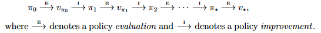

Each policy is guaranteed to be a strict improvement over the previous one.

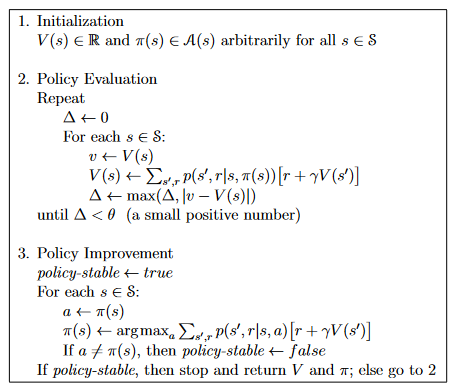

This way of finding an optimal policy is called *policy iteration*. 

### Value Iteration

One drawback to policy iteration is that each of its iterations involves policy evaluation, which may itself be a protracted iterative computation requiring multiple sweeps through the state set. The policy evaluation step of policy iteration can be truncated in several ways without losing the convergence guarantees of policy iteration. One important special case is when policy evaluation is stopped after just one sweep (one backup of each state). This algorithm is called *value iteration*. It can be written as a particularly simple backup operation that combines the policy improvement and truncated policy evaluation steps:

$$
v_{k+1}(s) = \max_a E[R_{t+1} + \gamma v_k(S_{t+1}) | S_t=s, A_t=a]
$$

$$
= \max_a \sum_{s^\prime, r} p(s^\prime, r, | s,a) [r + \gamma v_k(s^\prime)],
$$

for all $s \in S$.

Figure 3.4a shows the backup diagram for policy evaluation and Figure 3.7a shows the backup diagram for value iteration. These two are the natural backup operations for computing $v_\pi$ and $v_*$.

Value iteration effectively combines, in each of its sweeps, one sweep of policy evaluation and one sweep of policy improvement. Faster convergence is often achieved by interposing multiple policy evaluation sweeps between each policy improvement sweep. In general, the entire class of truncated policy iteration algorithms can be thought of as sequences of sweeps, some of which use policy evaluation backups and some of which use value iteration backups.

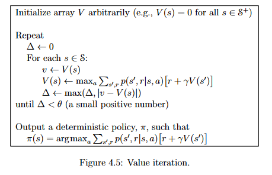

### Asynchronous Dynamic Programming

A major drawback to the DP methods that we have discussed so far is that they involve operations over the entire state set of the MDP, that is, they require sweeps of the state set. If the state set is very large, then even a single sweep can be prohibitively expensive. For example, the game of backgammon has over 1020 states. Even if we could perform the value iteration backup on a million states per second, it would take over a thousand years to complete a single sweep.

*Asynchronous* DP algorithms are in-place iterative DP algorithms that are not organized in terms of systematic sweeps of the state set. These algorithms back up the values of states in any order whatsoever, using whatever values of other states happen to be available. The values of some states may be backed up several times before the values of others are backed up once. To converge correctly, however, an asynchronous algorithm must continue to backup the values of all the states: it can’t ignore any state after some point in the computation. Asynchronous DP algorithms allow great flexibility in selecting states to which backup operations are applied.

We can apply backups to states as the agent visits them. This makes it possible to *focus* the DP algorithm’s backups onto parts of the state set that are most relevant to the agent.

### Generalized Policy Iteration

Policy iteration consists of two simultaneous, interacting processes, one making the value function consistent with the current policy (policy evaluation), and the other making the policy greedy with respect to the current value function (policy improvement). In policy iteration, these two processes alternate, each completing before the other begins, but this is not really necessary. In value iteration, for example, only a single iteration of policy evaluation is performed in between each policy improvement. In asynchronous DP methods, the evaluation and improvement processes are interleaved at an even finer grain. In some cases a single state is updated in one process before returning to the other. As long as both processes continue to update all states, the ultimate result is typically the same—convergence to the optimal value function and an optimal policy.

We use the term *generalized policy iteration* (GPI) to refer to the general idea of letting policy evaluation and policy improvement processes interact, independent of the granularity and other details of the two processes. Almost all reinforcement learning methods are well described as GPI. That is, all have identifiable policies and value functions, with the policy always being improved with respect to the value function and the value function always being driven toward the value function for the policy. This overall schema for GPI is illustrated in Figure 4.7.

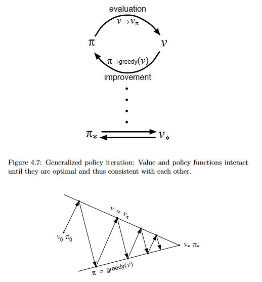

In GPI one could also take smaller, incomplete steps toward each goal. In either case, the two processes together achieve the overall goal of optimality even though neither is attempting to achieve it directly.

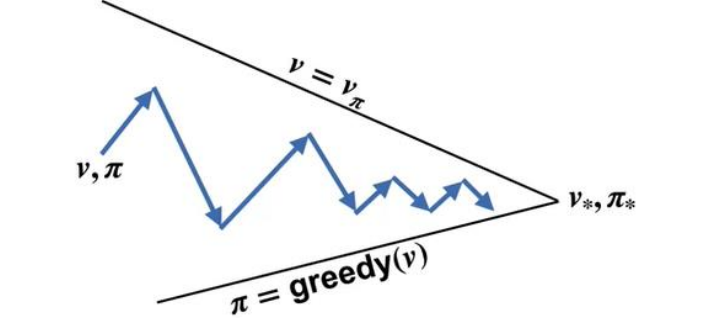

### Key Notes About Dynamic Programming

*Policy evaluation* refers to the (typically) iterative computation of the value functions for a given policy. *Policy improvement* refers to the computation of an improved policy given the value function for that policy. Putting these two computations together, we obtain *policy iteration* and *value iteration*, the two most popular DP methods. Either of these can be used to reliably compute optimal policies and value functions for finite MDPs given complete knowledge of the MDP.

We note one last special property of DP methods. All of them update estimates of the values of states based on estimates of the values of successor states. That is, they update estimates on the basis of other estimates. We call this general idea *bootstrapping*. Many reinforcement learning methods perform bootstrapping, even those that do not require, as DP requires, a complete and accurate model of the environment.

## Monte Carlo Methods

Here we do not assume complete knowledge of the environment. Monte Carlo methods require only *experience*—sample sequences of states, actions, and rewards from actual or simulated interaction with an environment. Learning from actual experience is striking because it requires no prior knowledge of the environment’s dynamics ($p(s^\prime, r|s,a)$), yet can still attain optimal behavior.

Monte Carlo methods are ways of solving the reinforcement learning problem based on averaging sample returns. To ensure that well-defined returns are available, here we define Monte Carlo methods only for episodic tasks. That is, we assume experience is divided into episodes, and that all episodes eventually terminate no matter what actions are selected. Only on the completion of an episode are value estimates and policies changed. Monte Carlo methods can thus be incremental in an episode-by-episode sense, but not in a step-by-step (online) sense.

Monte Carlo methods sample and average *returns* for each state–action pair much like the bandit methods. We *learn* value functions from sample returns with the MDP. The value functions and corresponding policies still interact to attain optimality in essentially the same way (GPI).

1) Prediction problem (the computation of $v_\pi$ and $q\pi$ for a fixed arbitrary policy $\pi$)
2) Policy Improvement
3) Control problem and its solution by GPI

### Monte Carlo Prediction

We begin by considering Monte Carlo methods for learning the state-value function for a given policy. Recall that the value of a state is the expected return—expected cumulative future discounted reward—starting from that state. An obvious way to estimate it from experience, then, is simply to average the returns observed after visits to that state. As more returns are observed, the average should converge to the expected value. This idea underlies all Monte Carlo methods.

In particular, suppose we wish to estimate $v_\pi(s)$, the value of a state $s$ under policy $\pi$, given a set of episodes obtained by following $\pi$ and passing through $s$. Each occurrence of state $s$ in an episode is called a *visit* to $s$. Of course, $s$ may be visited multiple times in the same episode; let us call the first time it is visited in an episode the *first visit* to $s$. The *first-visit MC method* estimates $v_\pi(s)$ as the average of the returns following first visits to $s$, whereas the *every-visit MC method* averages the returns following all visits to $s$.

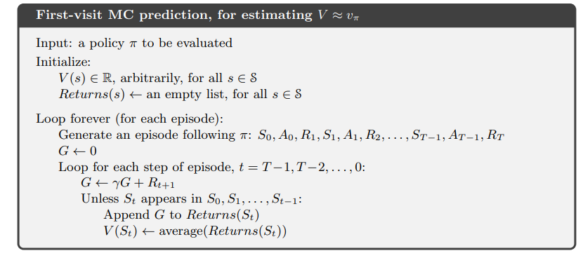

For Monte Carlo estimation of vπ, the root is a state node, and below it is the entire trajectory of transitions along a particular single episode, ending at the terminal state, as in Figure 5.3

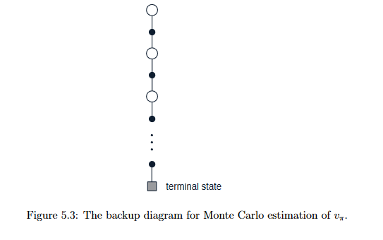

An important fact about Monte Carlo methods is that the estimates for each state are independent. The estimate for one state does not build upon the estimate of any other state, as is the case in DP. In other words, Monte Carlo methods do not *bootstrap*.

In particular, note that the computational expense of estimating the value of a single state is independent of the number of states. This can make Monte Carlo methods particularly attractive when one requires the value of only one or a subset of states. One can generate many sample episodes starting from the states of interest, averaging returns from only these states ignoring all others. This is a third advantage Monte Carlo methods can have over DP methods (after the ability to learn from actual experience and from simulated experience).

### Monte Carlo Estimation of Action Values

If a model is not available, then it is particularly useful to estimate action values (the values of state–action pairs) rather than *state* values. With a model, state values alone are sufficient to determine a policy; one simply looks ahead one step and chooses whichever action leads to the best combination of reward and next state, as we did in the chapter on DP. Without a model, however, state values alone are not sufficient. One must explicitly estimate the value of each action in order for the values to be useful in suggesting a policy. Thus, one of our primary goals for Monte Carlo methods is to estimate $q_*$. To achieve this, we first consider the policy evaluation problem for action values.

The policy evaluation problem for action values is to estimate $q_\pi(s, a)$, the expected return when starting in state $s$, taking action $a$, and thereafter following policy $\pi$. The Monte Carlo methods for this are essentially the same as just presented for state values, except now we talk about visits to a stateaction pair rather than to a state. A state–action pair $s, a$ is said to be visited in an episode if ever the state $s$ is visited and action $a$ is taken in it. The every-visit MC method estimates the value of a state–action pair as the average of the returns that have followed visits all the visits to it. The first-visit MC method averages the returns following the first time in each episode that the state was visited and the action was selected. These methods converge quadratically, as before, to the true expected values as the number of visits to each state–action pair approaches infinity.

The only complication is that many state–action pairs may never be visited. If $\pi$ is a deterministic policy, then in following $\pi$ one will observe returns only for one of the actions from each state. With no returns to average, the Monte Carlo estimates of the other actions will not improve with experience. This is a serious problem because the purpose of learning action values is to help in choosing among the actions available in each state. To compare alternatives we need to estimate the value of *all* the actions from each state, not just the one we currently favor.

For policy evaluation to work for action values, we must assure continual exploration. One way to do this is by specifying that the episodes *start in a state–action pair*, and that every pair has a nonzero probability of being selected as the start. This guarantees that all state–action pairs will be visited an infinite number of times in the limit of an infinite number of episodes. We call this the assumption of *exploring starts*.

### Monte Carlo Control

The overall idea is to proceed according to the same pattern as in the DP chapter, that is, according to the idea of generalized policy iteration (GPI). The value function is repeatedly altered to more closely approximate the value function for the current policy, and the policy is repeatedly improved with respect to the current value function:

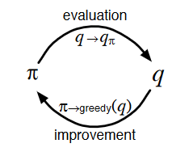

Let us assume that we do indeed observe an infinite number of episodes and that, in addition, the episodes are generated with exploring starts.

Policy improvement is done by making the policy greedy with respect to the current value function. In this case we have an action-value function, and therefore no model is needed to construct the greedy policy. For any action-value function $q$, the corresponding greedy policy is the one that, for each $s \in S$, deterministically chooses an action with maximal action-value:

$$
  \pi(s) = \argmax_aq(s,a)
$$

We made two unlikely assumptions above in order to easily obtain this guarantee of convergence for the Monte Carlo method. One was that the episodes have exploring starts, and the other was that policy evaluation could be done with an infinite number of episodes. To obtain a practical algorithm we will have to remove both assumptions.

For now we focus on the assumption that policy evaluation operates on an infinite number of episodes.

*(The first approach was not ideal)* The second approach to avoiding the infinite number of episodes nominally required for policy evaluation is to forgo trying to complete policy evaluation before returning to policy improvement. On each evaluation step we move the value function toward qπk, but we do not expect to actually get close except over many steps.

For Monte Carlo policy evaluation it is natural to alternate between evaluation and improvement on an episode-by-episode basis. After each episode, the observed returns are used for policy evaluation, and then the policy is improved at all the states visited in the episode. A complete simple algorithm along these lines is given in Figure 5.4. We call this algorithm Monte Carlo ES, for Monte Carlo with Exploring Starts.

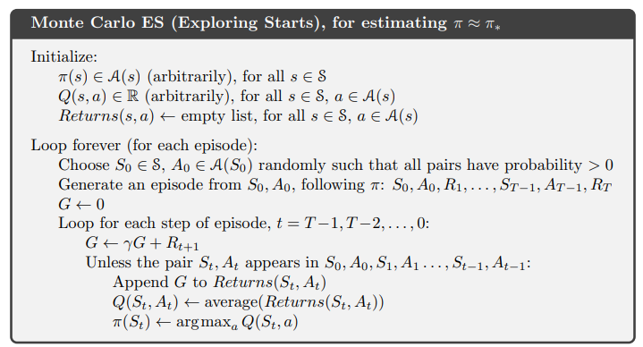

### Monte Carlo without Exploring Starts

How can we avoid the unlikely assumption of exploring starts? The only general way to ensure that all actions are selected infinitely often is for the agent to continue to select them. There are two approaches to ensuring this, resulting in what we call *on-policy* methods and *off-policy* methods. On-policy methods attempt to evaluate or improve the policy that is used to make decisions, whereas off-policy methods evaluate or improve a policy different from that used to generate the data. In this section we show how an on-policy Monte Carlo control method can be designed that does not use the unrealistic assumption of exploring starts.

In on-policy control methods the policy is generally *soft*, meaning that $\pi(s|a) \gt 0$ for all $s \in S$ and all $a \in A(s)$, but gradually shifted closer and closer to a deterministic optimal policy. The on-policy method we present in this section uses $\epsilon$-greedy policies, meaning that most of the time they choose an action that has maximal estimated action value, but with probability $\epsilon$ they instead select an action at random. That is, all nongreedy actions are given the minimal probability of selection, $\dfrac{\epsilon}{|A(s)|}$, and the remaining bulk of the probability, $1- \epsilon + \dfrac{\epsilon}{|A(s)|}$, is given to the greedy action. The $\epsilon$-greedy policies are examples of $\epsilon$-soft policies, defined as policies for which $\pi(a|s) \geq \dfrac{\epsilon}{|A(s)|}$ for all states and actions, for some $\epsilon \gt 0$. Among $\epsilon$-soft policies, $\epsilon$-greedy policies are in some sense those that are closest to greedy. 

Using the natural notion of greedy policy for $\epsilon$-soft policies, one is assured of improvement on every step, except when the best policy has been found among the $\epsilon$-soft policies. This analysis is independent of how the action-value functions are determined at each stage, but it does assume that they are computed exactly. This brings us to roughly the same point as in the previous section. Now we only achieve the best policy among the $\epsilon$-soft policies, but on the other hand, we have eliminated the assumption of exploring starts. The complete algorithm is given in Figure 5.6.

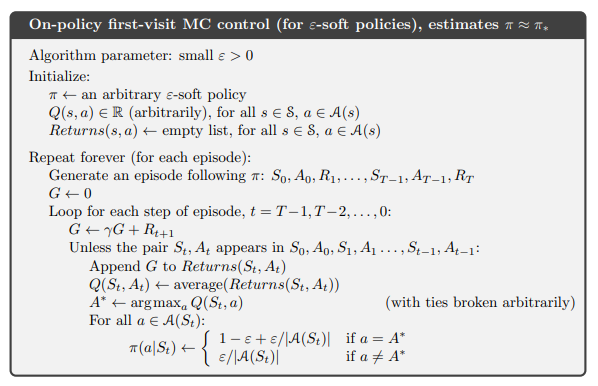

### Off-policy Prediction via Importance Sampling

All learning control methods face a dilemma: They seek to learn action values conditional on subsequent optimal behavior, but they need to behave non-optimally in order to explore all actions (to find the optimal actions). How can they learn about the optimal policy while behaving according to an exploratory policy? The on-policy approach in the preceding section is actually a compromise—it learns action values not for the optimal policy, but for a near-optimal policy that still explores. A more straightforward approach is to use two policies, one that is learned about and that becomes the optimal policy, and one that is more exploratory and is used to generate behavior. The policy being learned about is called the target policy, and the policy used to generate behavior is called the *behavior policy*. In this case we say that learning is from data “off” the target policy, and the overall process is termed *off-policy learning*.

On-policy methods are generally simpler and are considered first. O↵-policy methods require additional concepts and notation, and because the data is due to a di↵erent policy, o↵-policy methods are often of greater variance and are slower to converge. On the other hand, o↵-policy methods are more powerful and general.

In this section we begin the study of o↵-policy methods by considering the prediction problem, in which both target and behavior policies are fixed. That is, suppose we wish to estimate v⇡ or q⇡, but all we have are episodes following another policy b,where b 6= ⇡. In this case, ⇡ is the target policy, b is the behavior policy, and both policies are considered fixed and given.

In order to use episodes from b to estimate values for ⇡, we require that every action taken under ⇡ is also taken, at least occasionally, under b. That is, we require that ⇡(a|s) > 0impliesb(a|s) > 0. This is called the assumption of coverage. It follows from coverage that b must be stochastic in states where it is not identical to ⇡.The target policy ⇡, on the other hand, may be deterministic, and, in fact, this is a case of particular interest in control applications. In control, the target policy is typically the deterministic greedy policy with respect to the current estimate of the action-value function. This policy becomes a deterministic optimal policy while the behavior policy remains stochastic and more exploratory, for example, an "-greedy policy. In this section, however, we consider the prediction problem, in which ⇡ is unchanging and given.

Almost all off-policy methods utilize *importance sampling*, a general technique for estimating expected values under one distribution given samples from another. We apply importance sampling to o↵-policy learning by weighting returns according to the relative probability of their trajectories occurring under the target and behavior policies, called the *importance-sampling ratio*.

write importance sampling ratio formula/proof

Although the trajectory probabilities depend on the MDP’s transition probabilities, which are generally unknown, they appear identically in both the numerator and denominator, and thus cancel. The importance sampling ratio ends up depending only on the two policies and the sequence, not on the MDP.

**THIS PART IS INCOMPLETE**

TODO

### Incremental Implementation

TODO

### Off-policy Monte Carlo Control

TODO

## Temporal-Difference Learning

If one had to identify one idea as central and novel to reinforcement learning, it would undoubtedly be *temporal-difference* (TD) learning. TD learning is a combination of Monte Carlo ideas and dynamic programming (DP) ideas. Like Monte Carlo methods, TD methods can learn directly from raw experience without a model of the environment’s dynamics. Like DP, TD methods update estimates based in part on other learned estimates, without waiting for a final outcome (they bootstrap).

